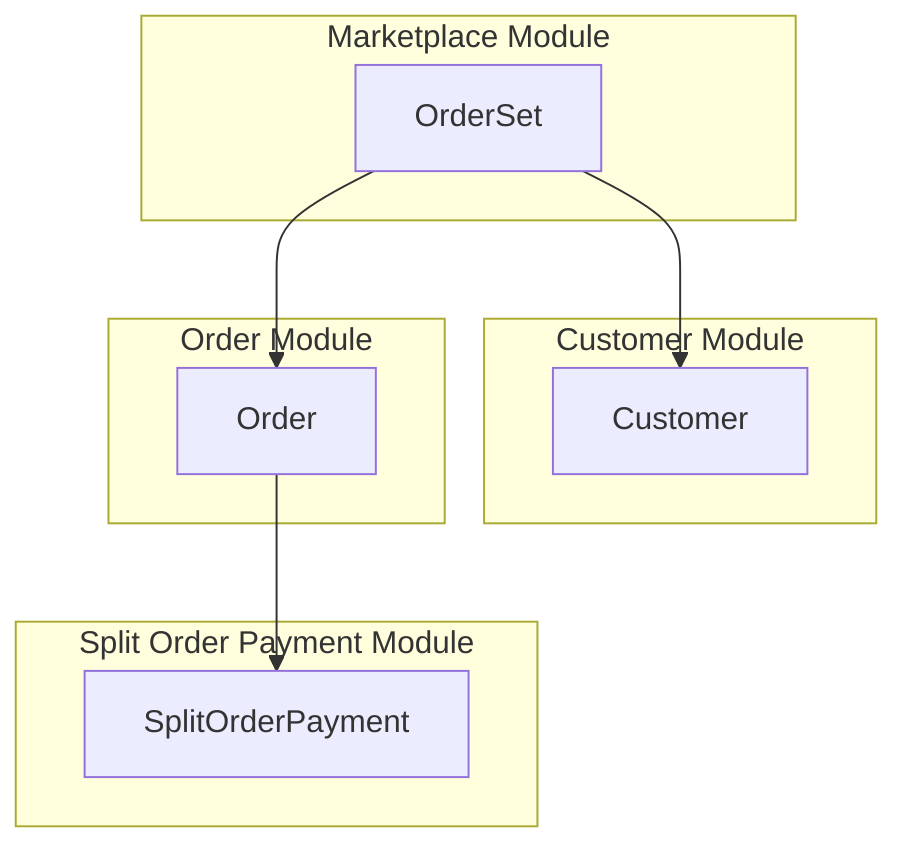

Order splitting allows you to split orders and payments between multiple vendors.

# Order Set

`OrderSet` is the entity that represents a group of orders that will be created from a cart.
`OrderSet` uses related orders to calculate totals and other properties for admin and storefront customers.
`SplitOrderPayment` is a partial payment information, only relevant for current seller.

