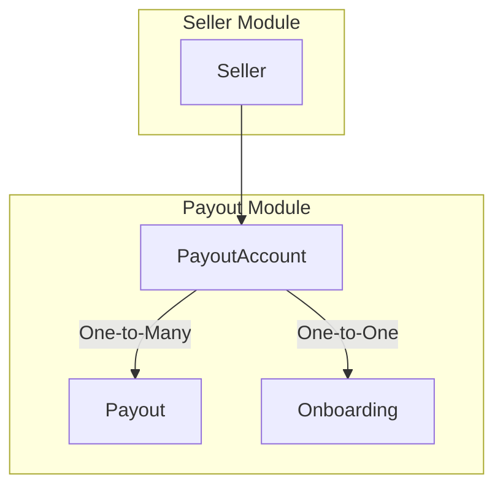
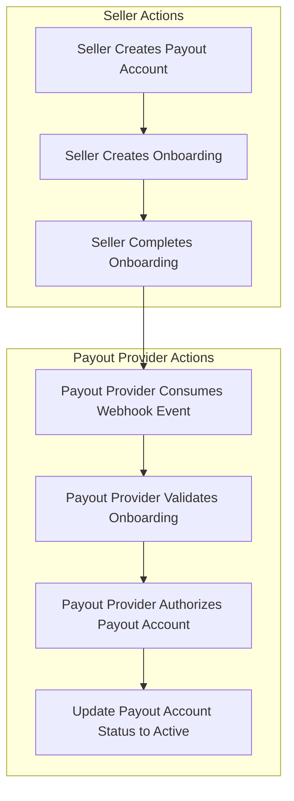
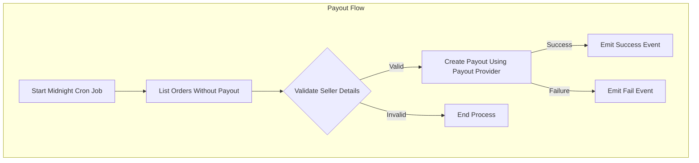

Mercur comes with a `Payout` module that allows you to manage payout accounts, onboardings and money transfers.

<Info>
  Mercur by default supports{" "}
  <a href="https://stripe.com/connect">Stripe Connect</a> as a payout provider.
</Info>

# Seller Onboarding Flow

# Payout Flow

Payout events can be consumed by subscribing to the `payout.succeeded` and `payout.failed` events. This allows you to perform actions like sending notification emails to sellers when payouts are processed successfully or fail.

