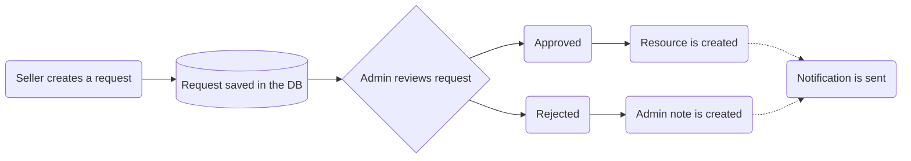
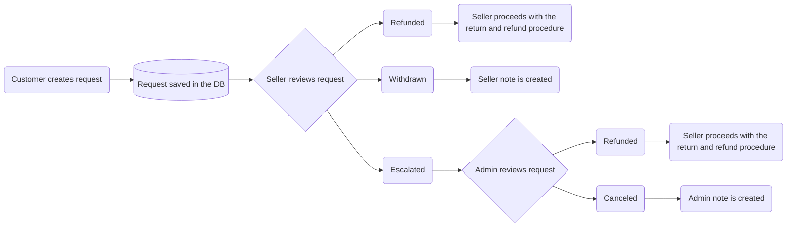

# Seller requests

Seller requests is a solution for sellers to create entity proposals. Each request needs to be reviewed by marketplace admin before it goes live.

### Request types

- `product` - create a new product. Admin can later set this `product` as a global product, or seller-specific.
- `product_collection` - create a new product collection.
- `product_type` - create a new product type.
- `product_category` - create a new product category.
- `review_remove` - ask to remove the unfair review from customer.

### Workflow

1. Seller creates a request by specifying proposed entity payload. His request is saved in the database with `pending` status.
2. Marketplace administrator has a list of all requests. They can be filtered by their type or status. After reviewing the request payload, he has to make a decision if the request should be approved or rejected.
3. If the administrator rejects the request, the entry changes status to `rejected`. Admin can also provide a note for the request submitter explaining his decision. Seller can be notified via email about the status change.
4. If the administrator approves the request, the entry changes status to `approved`, and appropiate resource will be created using payload provided by the submitter. Seller can be notified via email about the status change.



### Example

1. Seller wants to create a request for new `product_category`. He performs following request:

```
POST /api/vendor/requests
{
   "request": {
      "type": "product_category",
      "data": {
         "name": "Smartwatches",
         "description": "Lorem ipsum dolor sit amet, consectetur adipiscing elit",
         "parent_category_id": null
      }
   }
}
```

A following response is returned by server:

```
201 CREATED
{
   "id": "req_xxxx",
   "type": "product_category",
   "data": {
      "name": "Smartwatches",
      "description": "Lorem ipsum dolor sit amet, consectetur adipiscing elit",
      "parent_category_id": null
   },
   "submitter_id": "xyz",
   "reviewer_id": null,
   "reviewer_note": null,
   "status": "pending"
}
```

2. Administrator lists pending requests by performing request:

```
GET /api/admin/requests?status=pending
```

3. Administrator wants to accept the request, so performs update request with `accepted` status.

```
POST /api/admin/requests/req_xxxx
{
   "status": "accepted",
   "reviewer_note": "LGTM"
}
```

4. The product category is created, and admin gets a following response from the server:

```
200 OK
{
   "id": "req_xxxx",
   "status": "accepted",
   "createdResourceType": "product_category",
   "createdResource": {
      "id": "pcat_yyyy",
      ...
   }
}
```

5. If notifications are set up, Seller can be sent a message about the status update.

# Seller registration request

If the seller wants to sign up for the platform, he has to create a registration request. The flow is very similar to other types of requests.

### Workflow

1. User creates a seller sign up request.
2. Marketplace administrator has a list of all requests. They can be filtered by their type or status. After reviewing the request payload, he has to make a decision if the request should be approved or rejected.
3. If the administrator rejects the sign up request, the entry changes status to `rejected`. Admin can also provide a note for the request submitter explaining his decision. Submitter can be notified via email about the status change.
4. If the administrator approves the sign up request, the entry changes status to `approved`, and seller is created. Submitter can be notified via email about the status change.

# Order return requests

Marketplace customers, who want to return the order, partially or as a whole, can create `OrderReturnRequest`. Inside this object the customer provides array of the tuples `line_item_id` and `quantity`, as well as the `customer_note` (return reason).

### Workflow

1. Customer creates order return request, the status is `pending`
2. Seller reviews the return request. The review can have one of the following outcomes: `refunded`, `withdrawn` or `escalated`.
3. If the seller accepts the return, sets the status to `refunded`, and proceeds with the return and refund.
4. If the request does not meet the return criteria, seller sets the status to `withdrawn`, and provides the reason.
5. If the seller disagrees with the return reason, sets the status to `escalated`.
6. Requests with the `escalated` status are reviewed by the marketplace admin who makes the final decision. The decision can be either `refunded` or `canceled`. Admin can also provide the reason behind his decision.



# Requests events reference

### Seller Registration Events

- `requests.seller.created` - Triggered when a new seller registration request is created
- `requests.seller.accepted` - Triggered when a seller registration request is approved by admin
- `requests.seller.rejected` - Triggered when a seller registration request is rejected by admin

### Product Category Events

- `requests.product_category.accepted` - Triggered when a product category creation request is approved
- `requests.product_category.rejected` - Triggered when a product category creation request is rejected

### Product Collection Events

- `requests.product_collection.accepted` - Triggered when a product collection creation request is approved
- `requests.product_collection.rejected` - Triggered when a product collection creation request is rejected

### Product Events

- `requests.product.created` - Triggered when a new product creation request is submitted
- `requests.product.accepted` - Triggered when a product creation request is approved
- `requests.product.rejected` - Triggered when a product creation request is rejected

### Product Type Events

- `requests.product_type.accepted` - Triggered when a product type creation request is approved
- `requests.product_type.rejected` - Triggered when a product type creation request is rejected

### Product Tag Events

- `requests.product_tag.accepted` - Triggered when a product tag creation request is approved
- `requests.product_tag.rejected` - Triggered when a product tag creation request is rejected

### Generic Event

- `requests.*.created` - A generic event triggered when any type of request is created
