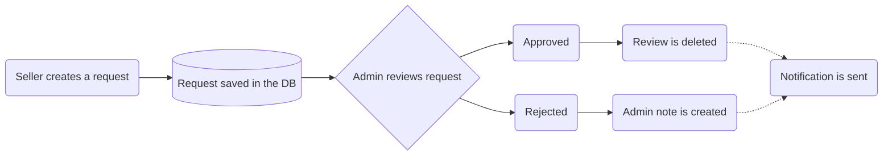

# Product reviews

Each customer is able to create a review about the product. The review object consists of integer rating value (1-5) and optional text comment (up to 300 characters). The average rating can be calculated in order to display on the product page. The customer can also list all the reviews he created.

### Example - Customer creates product review

```
POST /api/store/reviews
{
   "order_id": "ord_xxx",
   "reference": "product",
   "reference_id": "prod_xxx",
   "rating": 5,
   "customer_note": "Very good product"
}
```

### Example - List reviews

```
GET /api/store/reviews?offset=0&limit=50
```

# Seller reviews

Similarly to product reviews, customer can also create a review on the sellers. This type of review also includes integer rating value and comment.

Seller can respond to the review, or escalate to marketplace administrator, if he thinks that the review is against the rules or unfair.

### Example - Customer creates seller review

```
POST /api/store/reviews
{
   "order_id": "ord_xxx",
   "reference": "seller",
   "reference_id": "sel_xxx",
   "rating": 2,
   "customer_note": "Not very good seller"
}
```

### Example - Seller responds to the review

```
POST /api/vendor/sellers/me/reviews/rev_xxx
{
   "seller_note": "We are very sorry about your inconvenience"
}
```

### Escalating reviews

Seller can request to delete the review using `requests`. After submitting the request the marketplace administrator makes the decision to delete the review or not.

```
POST /api/vendor/requests
{
   "request": {
      "type": "review_remove",
      "data": {
         "review_id": "rev_xxx",
         "reason": "I consider this review unfair"
      }
   }
}
```


