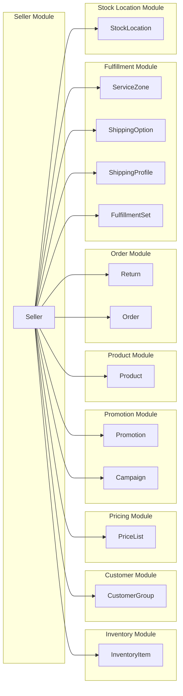
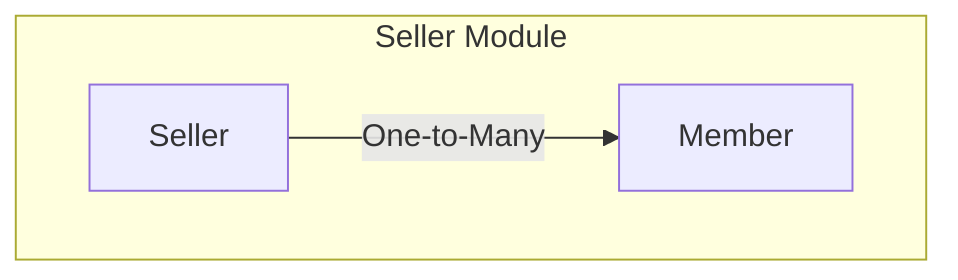
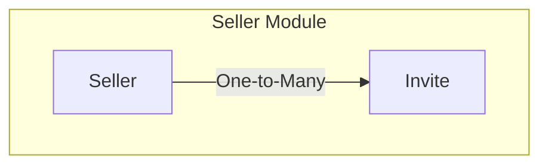
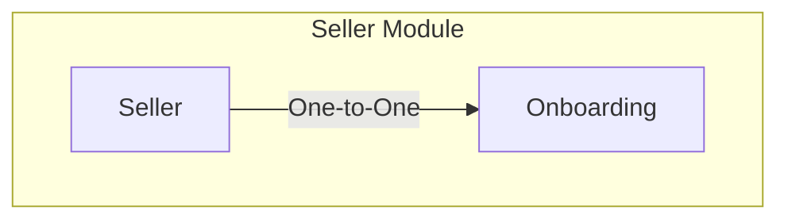

Mercur comes with a `Seller` module that allows you to manage seller products, team members, orders, stock locations and shipping options.

# Entities

- `Seller`
- `Member`
- `Invite`
- `Onboarding`

# Seller

In Mercur, the `Seller` is the entity that represents member group in the marketplace.
You can think of a seller as a group of members that share the same products, orders etc.

Seller can be in state `ACTIVE`, which allows him to use the platform, or in state `SUSPENDED`, which prevents him from using the platform, except order and fulfillment management.

By default, a seller is linked to Medusa's default entities such as:

- `Product`
- `Order`
- `Return`
- `Stock Location`
- `Service Zone`
- `Shipping Option`
- `Shipping Profile`
- `Fulfillment Set`
- `Promotion`
- `Campaign`
- `Price List`
- `Customer Group`
- `Inventory Item`

# Member

`Member` is the entity that represents a user in the marketplace that can manage seller products, orders, service zones etc.

# Member Invite

`Member Invite` is the entity that represents a pending member invitation to a seller in the marketplace.

# Onboarding

`Onboarding` is the entity that holds the information about current state of the onboarding of a seller.

