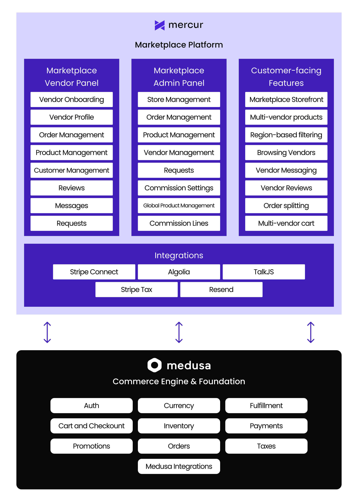

Building a marketplace shouldn’t mean choosing between expensive custom development and rigid SaaS platforms with transaction fees. After building multiple marketplaces from scratch, we saw the same pattern repeat itself: traditional e-commerce tools work well until a project requires multi-actor workflows, vendor-specific rules, onboarding steps, commissions, payouts, or any form of marketplace logic that extends beyond a single merchant.

Marketplace systems are different from stores - they need their own logic.

**That’s why we created Mercur.**

Mercur is an open-core **marketplace engine** designed for developers who need both the freedom of custom development and the stability of a structured, well-designed foundation. Instead of forcing your marketplace into predefined templates or rigid “marketplace modes,” Mercur provides a clean domain layer built specifically for multi-vendor systems.

Whether you’re building a B2C marketplace, a B2B marketplace, a rental or service marketplace, a niche vertical marketplace, or an entirely new hybrid model - Mercur gives you the building blocks to develop faster with marketplace logic ready.

It focuses on the crucial marketplaces logic: sellers, onboarding, moderation flows, commissions, multi-vendor cart and checkout, payouts, splitting, and all cross-actor operations. And because it’s built with customization in mind, you can adapt or replace any part of it when your business model demands something unique.

---

# **What is Mercur**

Mercur is a marketplace platform built on top of the **Medusa Framework**.

Medusa provides the underlying commerce engine - products, pricing, carts, orders, fulfillment, and events - while Mercur builds the marketplace domain layer on top of it.

Mercur keeps the commerce Medusa foundation, while giving you a complete engine for multi-vendor logic.

On top of Medusa’s core, Mercur introduces marketplace entities and workflows such as sellers, onboarding, product requests, commissions, reviews, return escalations, order splitting, vendor payouts, and dedicated Admin, Seller, and Storefront APIs.

It comes with three optional interfaces that demonstrate best practices and accelerate development:

- an **Admin Panel** for marketplace operators,
- a **Seller Panel** for vendor teams,
- and a **Storefront** ready for marketplace scenarios.

Mercur is designed to be deeply customizable. Every workflow is built with extension points, every model can be extended using Medusa’s framework, and every route can be overridden when custom behavior is required.

---

# **Why Mercur**

## **Built on a modern stack**

Mercur runs on a modern TypeScript backend powered by Medusa framework, giving you a proven foundation for products, carts, orders, promotions, and payments.

This frees you to focus entirely on the marketplace layer instead of re-implementing basic commerce logic.

Mercur also integrates cleanly with widely-used technologies like Resend (notifications), Algolia (search), and Stripe Connect (payouts), giving you production-ready components out of the box while keeping everything replaceable when needed.

## **Developer-first philosophy**

Mercur follows Medusa’s conventions: TypeScript throughout, workflow engine, events, modular plugins, and a clearly defined customization model. Developers can extend logic without patching core code or working around hidden internals. **The platform stays predictable even as complexity grows.**

## **Full extensibility and ownership**

Mercur is fully open-core and MIT-licensed.

**There are no transaction fees, no commercial lock-in, and no constraints that dictate how your marketplace must behave.** You own the entire codebase, can host it anywhere, and can extend or replace any component - workflows, models, APIs, or integrations.

It’s a platform you can use as a foundation without surrendering autonomy over your product.