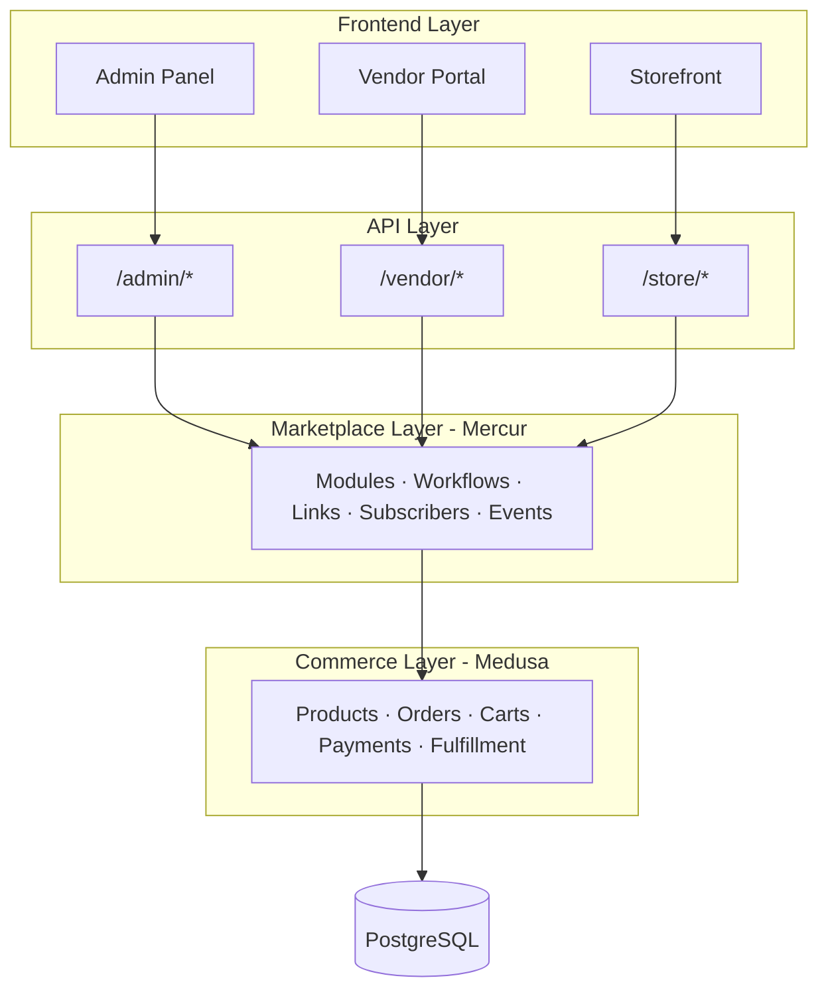

Mercur is the open-source enterprise marketplace platform, built on
[Medusa](https://medusajs.com). It is composable, API-first, and AI-native, and
it runs on infrastructure you own.

Mercur is not a standalone application, and it is not something you assemble from
scratch. Medusa provides the commerce engine, such as products, pricing, carts,
orders, payments, and fulfillment. Mercur adds the marketplace layer on top:
sellers, commissions, order splitting, payouts, and a governed change pipeline,
along with an admin panel and a vendor portal. Operators run the marketplace with
role-based access control and an auditable change history, on a codebase they own
outright.

This page explains how the platform is structured and how its parts fit together.

## High-level architecture

Mercur is layered. Each layer owns one responsibility and talks only to the layer
beneath it, so you can reason about, extend, or replace any layer on its own.



### Commerce layer

Medusa provides the core commerce engine: products, pricing, carts, orders,
payments, fulfillment, promotions, and inventory. Mercur does not replace any of
it. Mercur builds on top through Medusa's extension model, using custom modules,
links, workflows, and API routes. This is the one place the word framework
applies. Medusa is the commerce framework, and Mercur is the platform you run on
it.

### Marketplace layer

This is where Mercur's own code lives, packaged as the `@mercurjs/core` plugin. It
adds marketplace modules such as Seller, Commission, Offer, Payout, Product
Attribute, and Product Edit, plus the workflows that coordinate marketplace
operations like order splitting, product approvals, and commission calculation.
Links connect these modules to Medusa's core entities without modifying the
original models.

### API layer

Mercur exposes three sets of HTTP endpoints, one per audience.

| API        | Path        | Purpose                                                                    |
| ---------- | ----------- | -------------------------------------------------------------------------- |
| **Admin**  | `/admin/*`  | Platform administration: manage sellers, configure commission rates, view payouts. |
| **Vendor** | `/vendor/*` | Seller operations: manage products, orders, fulfillment, shipping, inventory, payouts. |
| **Store**  | `/store/*`  | Storefront: browse sellers, manage carts, check out with order splitting.   |

Each route is composed of a request handler, middleware, query configuration, and
Zod validators. The middleware is where access control lives, so every vendor
request is scoped to its own seller's data before the handler runs. See the
[API conventions](/references/api/conventions) for authentication and scoping.

### Panels and clients

Three interfaces consume the APIs.

- **Admin Panel:** a React application on Medusa UI. Operators approve sellers, set commission rates, and monitor payouts across the whole marketplace.
- **Vendor Portal:** a React application for sellers to manage products, orders, fulfillment, and payouts, scoped to their own store.
- **Storefront:** the customer-facing application. Build it with any frontend that consumes the Store API.

Both panels talk to the API through `@mercurjs/client`, a fully typed fetch
wrapper generated from the real route definitions, so requests and responses stay
in sync with the backend.

## Building blocks of the marketplace layer

The marketplace layer is assembled from four Medusa-native primitives. Together
they keep the platform composable: each piece is small, explicit, and replaceable.

### Modules

A module encapsulates the data models and business logic for one domain, such as
Seller or Commission. Each module is self-contained, with its own models, service,
and migrations. Modules never reference each other directly. They communicate
through links and workflows, which keeps domains decoupled.
[Learn about modules](/resources/best-practices/modules).

### Links

A link defines a relationship between a Mercur module and a Medusa core entity
without modifying either model. For example, the product-seller link connects a
Medusa `Product` to a Mercur `Seller` and acts as the allowlist of who may sell
what. Dozens of links wire the marketplace layer into the commerce layer.
[Learn about module links](/resources/best-practices/module-links).

### Workflows

A workflow orchestrates a multi-step operation that spans modules. Workflows
support compensation, which rolls back automatically on failure, and hooks, which
are the extension points you inject custom logic into. The central one is
`completeCartWithSplitOrdersWorkflow`, which validates a cart, splits it by
seller, creates an order for each, allocates payment, and calculates commissions.
[Learn about workflows](/resources/best-practices/workflows).

### Subscribers and events

Workflows emit events. Subscribers listen and run asynchronous side effects, such
as sending notifications, calling webhooks, or transferring payouts. This keeps
the core workflows focused while the platform reacts to change.
[Learn about subscribers and jobs](/resources/best-practices/subscribers-and-jobs).

## Enterprise governance by design

Governance lives in the architecture, not in a bolt-on. The same primitives that
make the platform composable also make it governable.

- **Role-based access control.** `withMercur()` registers a roles module, so vendor requests are scoped to their own seller by default. Operators and sellers each see only what their role permits.
- **An auditable change pipeline.** Every product edit is captured as an immutable `ProductChange` record: who changed what, and who approved it. Low-risk edits auto-confirm, and the rest wait for operator review.
- **Financial accuracy.** All commission arithmetic uses BigNumber with arbitrary precision, so split payments and payouts stay exact to the cent.
- **A governed surface for AI agents.** The typed client, exposed workflows, and `llms.txt` give AI agents structured contracts to build against, inside the same role and review guardrails as human users. Agents extend the platform. They do not bypass its governance.
- **You own the deployment.** Mercur is MIT-licensed and runs on infrastructure you control. Blocks ship as source code, so you own every line, with no hosted vendor in the request path and no commission on gross merchandise value.


## How a multi-vendor order flows

A single customer cart can hold items from many sellers. Order splitting is where
the marketplace, commerce, commission, and payout layers work together.

1. **Customer adds items** from multiple sellers to one cart (Store API).
2. **Cart completion** triggers the split-order workflow (marketplace layer).
3. Items are **grouped by seller**, and a separate order is created for each (commerce and marketplace layers).
4. **Commission lines** are calculated per order from the matching rates (Commission module).
5. **Payment is split** proportionally across the seller orders (commerce layer).
6. Each seller's order is **credited to its payout account** after commission (Payout module).
7. **Events are emitted**, triggering notifications, webhook calls, and other side effects (subscribers).
8. Sellers **manage their orders** through the Vendor Portal (Vendor API).
9. The operator **monitors everything** through the Admin Panel (Admin API).

## Technology stack

| Layer                | Technology                                          |
| -------------------- | --------------------------------------------------- |
| Runtime              | Node.js 20+, TypeScript                             |
| Commerce framework   | Medusa v2                                           |
| Database             | PostgreSQL                                          |
| Frontend             | React 18, React Router, Vite                        |
| Data fetching        | TanStack React Query                                |
| UI components        | Medusa UI, Radix UI                                 |
| Form handling        | React Hook Form, Zod                                |
| Tables               | TanStack React Table                                |
| Build                | Turborepo (monorepo), Bun (package manager), tsup   |
| Internationalization | i18next                                             |

## Core plugin layout

`@mercurjs/core` is the package that holds all marketplace logic. It is structured
as a standard Medusa plugin.

```
core/src/
├── modules/          # Data models and services
│   ├── seller/       # Seller registration, profiles, members, order groups
│   ├── commission/   # Commission rates, rules, calculation
│   ├── offer/        # Seller listings against the shared product catalog
│   ├── payout/       # Payout accounts, onboarding, payouts
│   ├── product-attribute/  # Typed attribute catalog and values
│   ├── product-edit/ # Product change requests and audit trail
│   └── ...           # Media, custom fields, and more
├── links/            # Relationships between modules
├── workflows/        # Multi-step business processes
│   ├── seller/       # Seller lifecycle workflows
│   ├── cart/         # Cart completion with order splitting
│   ├── commission/   # Commission rate and line management
│   ├── payout/       # Payout processing and crediting
│   ├── offer/        # Offer lifecycle
│   ├── product/      # Product approval and seller linking
│   ├── product-edit/ # Change-request lifecycle
│   ├── order-group/  # Order group operations
│   └── ...           # Attributes, shipping, inventory, promotions
├── api/              # HTTP route handlers
│   ├── admin/        # Admin API routes
│   ├── vendor/       # Vendor API routes
│   ├── store/        # Store API routes
│   └── hooks/        # Webhook handlers
├── subscribers/      # Event listeners
├── providers/        # Third-party provider integrations
└── jobs/             # Scheduled background tasks
```

## Distribution: blocks you own

Mercur ships features as blocks, not as an opaque dependency. The CLI copies
source code directly into your project, so a block is a self-contained piece of
functionality: a module, a workflow, an API route, or a UI extension.

This is what code ownership means in practice.

- **You own every line** of code in your project.
- **You can modify any block** to fit your business requirements.
- **There are no hidden abstractions** or version conflicts.
- **Updates are explicit.** You diff against the registry and apply the changes you want.

The CLI (`@mercurjs/cli@latest`) scaffolds projects, installs blocks, searches the
registry, and compares local changes against upstream.

## Workflow example

Workflows coordinate multi-step operations with automatic rollback on failure.
Here is a simplified example.

```typescript
import {
  createWorkflow,
  createStep,
  StepResponse,
  WorkflowResponse,
} from "@medusajs/framework/workflows-sdk"
import { MercurModules } from "@mercurjs/types"

const validateSellerStep = createStep(
  "validate-seller",
  async ({ seller_id }: { seller_id: string }, { container }) => {
    const sellerService = container.resolve(MercurModules.SELLER)
    const seller = await sellerService.retrieveSeller(seller_id)

    if (seller.status !== "open") {
      throw new Error("Seller is not active")
    }

    return new StepResponse(seller)
  }
)

const createProductForSellerWorkflow = createWorkflow(
  "create-product-for-seller",
  (input: { seller_id: string }) => {
    const seller = validateSellerStep({ seller_id: input.seller_id })

    // Additional steps: create product, link to seller, and so on.

    return new WorkflowResponse({ seller })
  }
)
```

## Design principles

These principles explain why the architecture looks the way it does.

- **Enterprise is the noun, composable is the how.** Mercur is a marketplace platform first. Composability, open source, and AI-nativeness are how it becomes a better enterprise choice than a closed platform, not a step down from one.
- **Modular over monolithic.** Each marketplace feature is a separate module you can install, modify, or replace on its own. You do not need all of Mercur to benefit from it.
- **Explicit over implicit.** Relationships are declared through links, not buried in service code. Workflows make multi-step operations visible and debuggable. API routes are file-based and predictable.
- **Extensible over configurable.** Instead of hundreds of config flags, Mercur gives you extension points. Workflows have hooks, providers are pluggable, and models extend through Medusa. When configuration is not enough, you change the source you own.
- **Commerce-aware.** Mercur does not reinvent commerce. It delegates products, pricing, orders, payments, and fulfillment to Medusa and focuses on the marketplace logic that multi-vendor systems need.

## Next steps

<CardGroup cols={2}>
  <Card title="Platform modules" href="/platform/store/overview">
    Data models, workflows, and events for each marketplace domain.
  </Card>
  <Card title="Blocks" href="/learn/blocks">
    How features ship as source code you own, not an opaque dependency.
  </Card>
  <Card title="API reference" href="/references/api/conventions">
    Authentication, seller scoping, and the Admin, Vendor, and Store APIs.
  </Card>
  <Card title="Panel extensions" href="/references/panel-extensions/overview">
    Extend the admin and vendor panels without forking them.
  </Card>
</CardGroup>
