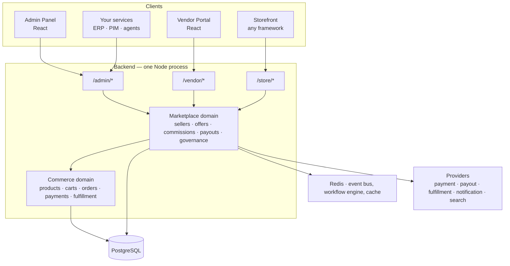
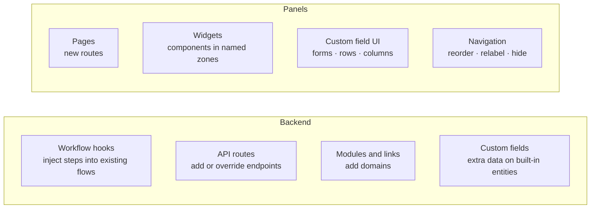

Mercur is an open-source marketplace platform. It gives you a multi-vendor
commerce backend, an admin panel, and a vendor portal that you deploy on your own
infrastructure and change at the source level.

It is not a hosted service you integrate with, and it is not a starter kit you
finish yourself. Mercur is a running system on day one, with defined seams for
the parts every marketplace does differently: onboarding rules, commission logic,
approval policy, back-office integrations, and the screens your teams work in.

This page describes those layers and those seams. If you are evaluating Mercur,
the two questions it answers are **what runs where** and **where does my code go**.

## Design principles

Everything below follows from four decisions.

- **You run it.** MIT-licensed, PostgreSQL, Node. No vendor in the request path, no GMV fee, no proprietary runtime. Self-host, or deploy to any cloud that runs a Node process and a database.
- **Extension over configuration.** Instead of hundreds of settings, the platform exposes typed extension zones: workflow hooks, API routes, modules, custom fields, pages, and widgets. When a zone isn't enough, the source is yours to change.
- **Marketplace on top of commerce, not instead of it.** Products, carts, orders, payments, and fulfillment are handled by [Medusa](https://medusajs.com), a mature commerce engine. Mercur adds only what multi-vendor requires: sellers, offers, order splitting, commissions, payouts, and governance.
- **Governance is structural.** Role scoping, the product change pipeline, and exact-precision money arithmetic are properties of the architecture, not features you enable.

## The layers

Mercur is a single deployable backend with three API surfaces, plus two panel
applications that are ordinary clients of those APIs.



### Data

One PostgreSQL database. Every domain owns its own tables and never reaches into
another's; relationships across domains are declared explicitly as links (see
[Links](#links)). That isolation is what makes a domain replaceable, and what
keeps a schema change local instead of platform-wide.

Redis backs the event bus, the workflow engine, and caching in production. In
development both fall back to in-memory implementations, so a laptop needs
nothing but Postgres.

### Domain

The domain layer is where marketplace behaviour lives: seller accounts and
members, offers against a shared product catalog, commission rules and their
resolution, payout accounts and transfers, order groups, the product change
pipeline. It calls into the commerce domain for anything commerce already does.

Two things about this layer matter to an architect:

- **It is not a wrapper.** Mercur does not proxy or re-implement commerce endpoints. Marketplace concepts are first-class records with their own lifecycle, joined to commerce records through links.
- **Your own domains sit beside it.** A module you write, a module Mercur ships, and a module Medusa ships are the same kind of object, registered the same way, with the same access to the container, the event bus, and the workflow engine. There is no privileged inner ring.

### API

Three HTTP surfaces, one per audience, separated because their authorization
models differ, not because their data does.

| Surface    | Path        | Audience              | Scoping                                                            |
| ---------- | ----------- | --------------------- | ------------------------------------------------------------------ |
| **Admin**  | `/admin/*`  | Marketplace operators | Platform-wide, gated by role                                       |
| **Vendor** | `/vendor/*` | Sellers               | Every request is narrowed to the caller's seller before the handler |
| **Store**  | `/store/*`  | Customers, storefront | Public catalog and the caller's own cart, orders, and account       |

A route is a thin adapter: middleware authenticates and scopes, a Zod validator
checks the payload, and the handler runs a workflow for writes or the query
engine for reads. Business logic does not live in routes, which is why adding
one is cheap and overriding one is safe. See the
[API conventions](/references/api/conventions).

### Clients

The admin panel and the vendor portal are separate React applications, not a
templated back office. They talk to the backend through `@mercurjs/client`, a
typed fetch wrapper generated from the real route definitions — including routes
you add — so a backend change that breaks a caller fails at `tsc`, not in
production.

The storefront is deliberately not shipped as a fixed application. Anything that
speaks HTTP consumes the Store API; a reference Next.js storefront is available
to start from.

## The building blocks

Four primitives compose the domain layer. You use the same four to extend it.

### Modules

A module owns one domain: its data models, its service, its migrations. Modules
never import each other. That constraint is what lets you swap Mercur's
commission logic for your own, or drop a module you don't use, without a
refactor rippling outward. [Modules →](/resources/best-practices/modules)

### Links

A link declares a relationship between records in two modules without either
module knowing about the other. The product–seller link, for example, is what
allowlists which sellers may sell a given product — expressed as a link rather
than a foreign key, so neither the product model nor the seller model is
modified. Your modules link to built-in entities exactly the same way.
[Links →](/resources/best-practices/module-links)

### Workflows

A workflow is a multi-step operation with automatic compensation: if step five
fails, steps one through four roll back. Anything that crosses domains or must
not half-happen is a workflow — seller approval, payout transfer, and above all
cart completion, which validates the cart, splits it by seller, creates an order
each, allocates payment, and computes commission lines as one atomic unit.

Workflows also expose **hooks**, which is the primary backend extension zone.
[Workflows →](/resources/best-practices/workflows)

### Events and subscribers

Workflows emit events; subscribers react asynchronously. Notifications, webhooks
to your systems, search indexing, and payout side effects all hang off this,
which keeps the transactional path short and lets you add behaviour without
touching the workflow that triggered it.
[Subscribers and jobs →](/resources/best-practices/subscribers-and-jobs)

## Extension zones

This is the part that determines what a build actually costs. Mercur exposes six
zones. Each one is typed, each one is additive, and none of them require forking
or patching platform code.



### 1. Workflow hooks — change what happens

The default way to change platform behaviour. A hook is a declared point inside
an existing workflow where you register your own step. Your step runs inside the
original transaction and participates in its rollback, so you are not
reimplementing the flow to add one rule.

```ts src/workflows/hooks/seller-approved.ts
import { approveSellerWorkflow } from "@mercurjs/core/workflows"

approveSellerWorkflow.hooks.sellerApproved(
  async ({ seller_id }, { container }) => {
    await container.resolve("erp").createVendorAccount(seller_id)
  }
)
```

Reach for a hook when the answer is "the standard flow, plus something."
[Extend a workflow →](/resources/customization/extend-a-workflow)

### 2. API routes — add endpoints

Drop a `route.ts` under `src/api/**` and the endpoint exists. Routes nest under
the built-in ones, so a new resource can hang off an existing entity rather than
living off to the side.

```
src/api/vendor/sellers/documents/route.ts       →  GET/POST /vendor/sellers/documents
src/api/vendor/sellers/documents/[id]/route.ts  →  GET/DELETE /vendor/sellers/documents/:id
```

Your routes get the same treatment as the built-in ones: vendor requests are
already scoped to the caller's seller by the surrounding middleware, and codegen
picks the route up so it appears on the typed client with real request and
response types.

[Create an API route →](/resources/best-practices/api-routes)

### 3. Modules and links — add domains

When the data has its own lifecycle — subscriptions, RMAs, contracts, quotas —
it is a module, not a field. You define the models and service, link the module
to the built-in entities it relates to, and it becomes queryable in the same
graph as everything else. This is how substantial vertical features get built,
and it is the same mechanism Mercur's own domains use.

### 4. Custom fields — add data to built-in entities

For one plain property on an existing record — `is_featured` on a product,
`tier` on a customer — you declare the field in configuration and the storage,
link, and migration are generated for you.

```ts medusa-config.ts
{
  resolve: "@mercurjs/core/modules/custom-fields",
  options: {
    customFields: {
      Product: { is_featured: { type: "boolean", nullable: true } },
    },
  },
}
```

One row per parent, no lifecycle of its own; anything more is a module.
[Custom fields →](/resources/best-practices/custom-fields)

### 5. Panel pages and widgets — change what teams see

The panels are extended by file convention. A file's folder decides what it does,
and there is no manifest to maintain.

| Path                     | Adds                                  |
| ------------------------ | ------------------------------------- |
| `src/routes/**/page.tsx` | A new page and its route              |
| `src/widgets/**`         | A component in a named zone on a built-in page |
| `src/custom-fields/**`   | Form fields, detail rows, and list columns on a built-in model |
| `src/_navigation.ts`     | Sidebar order, labels, and visibility  |

A widget targets a slot on an existing page, which is how you put a payout
summary on the order detail screen without owning that screen:

```tsx apps/vendor/src/widgets/payout-summary.tsx
export const config = defineWidgetConfig({ zone: "orders.detail.side.after" })
```

Zone ids, model names, and field ids are generated per panel into
`extension-targets.d.ts`, so a mistargeted extension fails type-checking instead
of silently not rendering.
[Panel extensions →](/references/panel-extensions/overview)

### 6. Blocks — install features as source

Larger features ship as blocks. The CLI copies the source into your project
rather than adding a dependency, so a block is yours from the moment it lands:
readable, debuggable, and modifiable without waiting on an upstream release.
Updates are explicit — `diff` against the registry and take what you want.

```bash
bunx @mercurjs/cli@latest add reviews
```

[Blocks →](/learn/blocks)

### Choosing a zone

| You want to…                                        | Use                     |
| --------------------------------------------------- | ----------------------- |
| Add a rule or side effect to an existing operation   | Workflow hook           |
| Expose new data or a new operation over HTTP         | API route               |
| Model something with its own lifecycle               | Module and link         |
| Store one extra property on a built-in entity        | Custom field            |
| Show or capture something in the panels              | Page, widget, or custom-field UI |
| Adopt a whole feature and own it                     | Block                   |

## Governance

Multi-vendor means untrusted writers, so the guarantees operators need are built
into the layers rather than layered on.

- **Scoping before handling.** Vendor requests are narrowed to the caller's seller in middleware, ahead of any handler. A route cannot accidentally leak across sellers, including a route you add.
- **An immutable change pipeline.** Product edits are recorded as `ProductChange` entries — who changed what, who approved it, when. Low-risk edits auto-confirm; the rest queue for review. The audit trail is the mechanism, not a log written beside it.
- **Exact money.** Commission and payout arithmetic uses arbitrary-precision numbers throughout, so splitting a payment across sellers stays exact.
- **Agents inside the same guardrails.** The typed client, exposed workflows, `llms.txt`, and the MCP server give AI agents structured contracts — subject to the same roles and the same review pipeline as human users.

## How a multi-vendor order flows

One cart, several sellers. This is the path that touches every layer.

1. The customer adds items from multiple sellers to a single cart (Store API).
2. Cart completion starts the split-order workflow.
3. Items are grouped by seller and an order is created per seller, all under one order group.
4. Commission lines are computed per order from the matching rules.
5. Payment is allocated proportionally across the seller orders.
6. Each seller's share is credited to its payout account, net of commission.
7. Events fire: notifications, webhooks, indexing, and any hook you registered.
8. Sellers fulfill their own orders in the vendor portal; the operator sees all of it in the admin panel.

Steps 2 through 6 are a single workflow. If any of it fails, none of it happened.

## Stack

| Concern            | Technology                                   |
| ------------------ | -------------------------------------------- |
| Runtime            | Node.js 20+, TypeScript                      |
| Commerce engine    | Medusa v2                                    |
| Database           | PostgreSQL                                   |
| Events, cache      | Redis (in-memory fallback in development)    |
| Panels             | React 18, Vite, Medusa UI, TanStack Query    |
| Validation, forms  | Zod, React Hook Form                         |
| Build              | Turborepo, Bun, tsup                         |

Mercur's own code is distributed as `@mercurjs/core`, a Medusa plugin registered
by `withMercur()` in your `medusa-config.ts`. That packaging matters when you
upgrade; it does not change any of the above.

## Next steps

<CardGroup cols={2}>
  <Card title="Platform modules" href="/platform/store/overview">
    Data models, workflows, and events for each marketplace domain.
  </Card>
  <Card title="Panel extensions" href="/references/panel-extensions/overview">
    Pages, widgets, custom fields, and navigation.
  </Card>
  <Card title="Extend a workflow" href="/resources/customization/extend-a-workflow">
    Inject a step into an existing flow through a hook.
  </Card>
  <Card title="API reference" href="/references/api/conventions">
    Authentication, seller scoping, and the three API surfaces.
  </Card>
</CardGroup>
