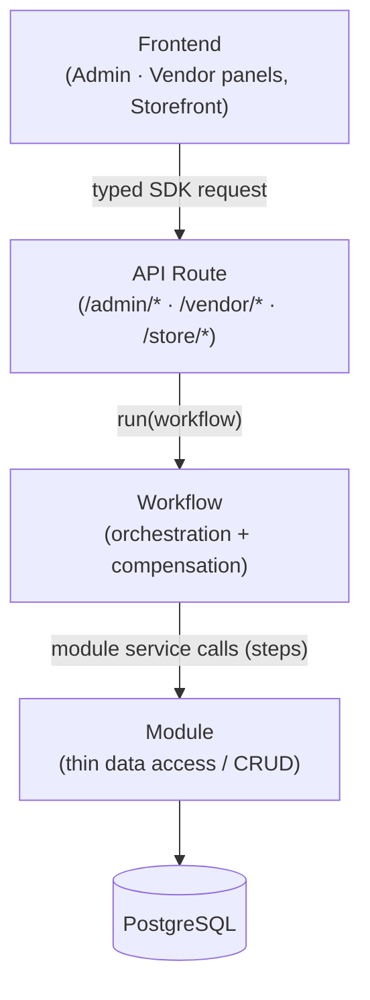

This section is a practical guide for developing on Mercur, written for both **human developers** and **AI coding agents**. It captures the conventions the codebase already follows so that new code reads as if it belongs, stays testable, and survives upgrades of the underlying Medusa framework.

<Note>
  Mercur is a marketplace platform built on Medusa. Every rule here is either a Medusa requirement or a Mercur convention that keeps the marketplace layer consistent. When Medusa's docs and this guide agree, follow both; when in doubt, mirror an existing module, workflow, or route in `packages/core`.
</Note>

## The layered architecture

Every feature in Mercur flows through the same four layers, top to bottom. Data and requests move **down**; results move back **up**. A layer may only talk to the layer directly beneath it.

<CardGroup cols={2}>
  <Card title="Module" icon="cube">
    Owns one domain's data. Thin CRUD only, with no orchestration and no cross-module calls.
  </Card>
  <Card title="Workflow" icon="diagram-project">
    Orchestrates a business operation across modules, step by step, with automatic rollback (compensation) on failure.
  </Card>
  <Card title="API Route" icon="plug">
    A thin HTTP adapter: validate input, run a workflow (or query for reads), shape the response.
  </Card>
  <Card title="Frontend" icon="window">
    Admin/Vendor panels and storefront. Talks to the API only through the typed SDK, never raw `fetch`.
  </Card>
</CardGroup>

Why this shape matters:

- **Testability:** business logic lives in workflows, which can be run in isolation without an HTTP request.
- **Reusability:** a workflow can be called from a route, a subscriber, or a scheduled job.
- **Upgrade safety:** modules stay thin, so Medusa framework upgrades rarely touch your logic.
- **Rollback:** because mutations are workflow steps, a failure halfway through automatically undoes the earlier steps.

## The non-negotiables

These are hard rules. Breaking one produces code that looks like it works but silently violates the architecture, with no rollback, broken upgrades, or data written outside a workflow.

<Warning>
  **All mutations go through a workflow.** Never write to the database directly from an API route, a subscriber, or a scheduled job. Reads may query directly; writes must run a workflow so they get validation, compensation, and event emission.
</Warning>

<Warning>
  **Only `GET`, `POST`, and `DELETE`.** Mercur (following Medusa) does not use `PUT` or `PATCH`. Updates are modeled as `POST` to the resource. Keep every route to these three verbs.
</Warning>

<Warning>
  **No cross-module service calls.** A module service must never import or call another module's service. Modules are isolated. Cross-module reads happen through **Query** (the graph); cross-module relationships are declared with **module links**; cross-module writes are coordinated in a **workflow**.
</Warning>

Two more that follow from the above:

- **Modules are thin.** A module service is CRUD plus small, self-contained helpers. If a method touches more than one module's data, it belongs in a workflow, not the service.
- **One mutation per step.** Each workflow step performs a single mutation and defines how to compensate it. This is what makes rollback reliable.

## Logic-placement cheat sheet

When you're about to write a piece of logic, find the concern in this table before you decide where the code goes. The **"Never put it in"** column is the part people get wrong.

| Concern | Put it in | Never put it in |
| --- | --- | --- |
| **Input shape / type validation** | API route (Zod schema on the request) | Module service, workflow |
| **Ownership / scoping** (e.g. this seller may only see its own orders) | API middleware (filters) + workflow guard | The frontend alone |
| **Business orchestration** (multi-step, multi-module operations) | Workflow (steps + compensation) | API route handler, module service |
| **A single data mutation** | Workflow step (module service call inside it) | API route, subscriber, job |
| **Cross-module reads** | Query (`query.graph`) | Direct service-to-service imports |
| **Cross-module relationships** | Module link (`defineLink`) | A foreign key inside one module's model |
| **Reacting to something that happened** (emails, sync, indexing) | Subscriber (listens to an event, runs a workflow) | Inline inside the route that caused it |
| **Periodic / time-based work** (polling, daily settlement) | Scheduled job (runs a workflow) | A subscriber, a route |
| **Emitting domain events** | Workflow step (`emitEventStep`) | Module service, subscriber |
| **Response shaping / field selection** | API route `queryConfig` (fields) | The module service |
| **Presentation, composition, UX** | Frontend (panels / storefront) | The API or any backend layer |

<Tip>
  A quick mental test: *"Does this change data?"* → it must run inside a workflow. *"Does this react to a change?"* → it's a subscriber. *"Does this run on a schedule?"* → it's a job. *"Is this just reading and shaping data for a screen?"* → it's a route + Query. Everything else is either module CRUD or frontend.
</Tip>

## Guides

Follow these guides to build each layer the Mercur way.

### Server

<CardGroup cols={2}>
  <Card title="Create a Module" href="/resources/best-practices/modules" icon="cube">
    Thin CRUD, naming, and what must never live in a service.
  </Card>
  <Card title="Link Modules" href="/resources/best-practices/module-links" icon="link">
    `defineLink`, link direction, and filtering by links.
  </Card>
  <Card title="Create a Workflow" href="/resources/best-practices/workflows" icon="diagram-project">
    Composition constraints, steps, compensation, and the query engine.
  </Card>
  <Card title="Create an API Route" href="/resources/best-practices/api-routes" icon="plug">
    Thin adapters, Zod validation, middlewares as filters, `queryConfig`.
  </Card>
  <Card title="Subscribers & Jobs" href="/resources/best-practices/subscribers-and-jobs" icon="clock">
    Event-driven side effects and scheduled work done safely.
  </Card>
  <Card title="Add a Custom Field" href="/resources/best-practices/custom-fields" icon="table-cells">
    Attach data to an entity end-to-end, from core to the panels.
  </Card>
</CardGroup>

### Panels

<CardGroup cols={2}>
  <Card title="Extend the Panels" href="/resources/customization/extending-panels" icon="window">
    The extension model shared by the Admin and Vendor panels.
  </Card>
  <Card title="Add a Widget" href="/resources/tutorials/add-a-widget" icon="puzzle-piece">
    Inject a component into a built-in page zone.
  </Card>
</CardGroup>

### Blocks

<CardGroup cols={2}>
  <Card title="Add a Block" href="/resources/tutorials/add-a-block" icon="cubes">
    Install a feature block into your project.
  </Card>
  <Card title="Build a Block" href="/resources/tutorials/build-a-block" icon="hammer">
    Package your own feature as a distributable block.
  </Card>
</CardGroup>
