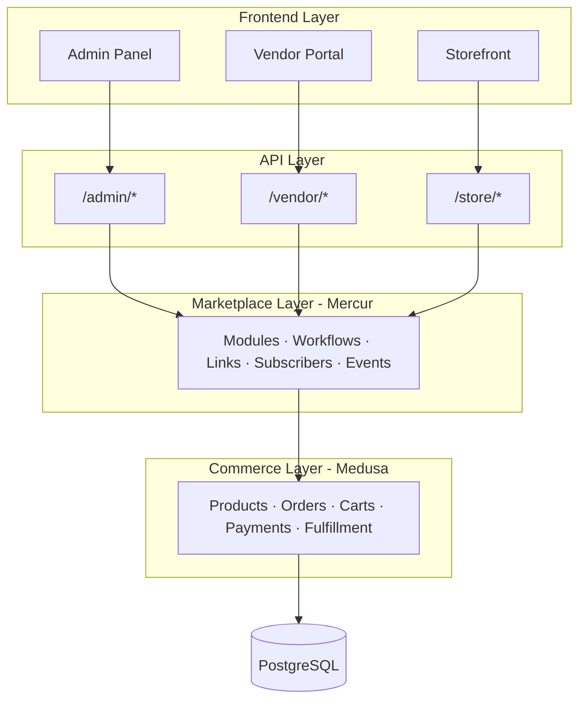

<Snippet file="canary-warning.mdx" />

Mercur is a marketplace platform built on top of [MedusaJS](https://medusajs.com), an open-source headless commerce framework. Rather than being a standalone application, Mercur extends Medusa with marketplace-specific logic — sellers, commissions, order splitting, payouts — while Medusa handles the foundational commerce layer.

This page explains how the system is structured and how its components interact.

## Architecture

Mercur follows a layered architecture where each layer has a distinct responsibility:



### Commerce layer

Medusa provides the core commerce engine — products, pricing, carts, orders, payments, fulfillment, promotions, and inventory. Mercur does not replace any of this. Instead, it builds on top using Medusa's extension model: custom modules, links, workflows, and API routes.

### Marketplace layer

This is where Mercur's code lives. It introduces three custom modules — **Seller**, **Commission**, and **Payout** — along with workflows that coordinate marketplace-specific operations like order splitting and commission calculation. Links connect these modules to Medusa's core entities (products, orders, customers) without modifying the original models.

### API layer

Mercur exposes three sets of HTTP endpoints:

| API | Path | Purpose |
|-----|------|---------|
| **Admin** | `/admin/*` | Platform administration — manage sellers, configure commission rates, view payouts |
| **Vendor** | `/vendor/*` | Seller operations — manage products, orders, fulfillment, shipping, inventory, payouts |
| **Store** | `/store/*` | Storefront — browse sellers, manage carts, checkout with order splitting |

Each API route is composed of a request handler, middleware, query configuration, and Zod validators.

### Frontend layer

Three interfaces consume the APIs:

- **Admin Panel** — Built with React and Medusa UI components. Operators use it to manage the marketplace: approve sellers, set commission rates, handle disputes.
- **Vendor Portal** — A React application for sellers to manage their products, orders, fulfillment, and payouts. Uses file-based routing via the Dashboard SDK.
- **Storefront** — Customer-facing application. Can be built with any frontend technology that consumes the Store API.

## Technology stack

| Layer | Technology |
|-------|-----------|
| Runtime | Node.js 20+, TypeScript |
| Framework | MedusaJS v2 |
| Database | PostgreSQL |
| Frontend | React 18, React Router, Vite |
| Data fetching | TanStack React Query |
| UI components | Medusa UI, Radix UI |
| Form handling | React Hook Form, Zod |
| Tables | TanStack React Table |
| Build | Turborepo (monorepo), Bun (package manager), tsup |
| Internationalization | i18next |

## Core plugin

The core plugin (`@mercurjs/core-plugin`) is the main package that contains all marketplace logic. It's structured as a standard MedusaJS plugin:

```
core-plugin/src/
├── modules/          # Data models and services
│   ├── seller/       # Seller registration, profiles, order groups
│   ├── commission/   # Commission rates, rules, calculation
│   └── payout/       # Payout accounts, balances, transactions
├── links/            # Relationships between modules
├── workflows/        # Multi-step business processes
│   ├── seller/       # Seller CRUD workflows
│   ├── cart/         # Cart completion with order splitting
│   ├── commission/   # Commission rate and line management
│   ├── payout/       # Payout processing and crediting
│   ├── order-group/  # Order group operations
│   ├── promotion/    # Seller promotion workflows
│   ├── price-list/   # Price list operations
│   └── ...           # Shipping, inventory, campaigns, etc.
├── api/              # HTTP route handlers
│   ├── admin/        # Admin API routes
│   ├── vendor/       # Vendor API routes
│   ├── store/        # Store API routes
│   └── hooks/        # Webhook handlers
├── subscribers/      # Event listeners
├── providers/        # Third-party provider integrations
└── jobs/             # Scheduled background tasks
```

### Modules

Modules encapsulate data models and business logic for a specific domain. Each module is self-contained with its own models, service, migrations, and repositories. Modules don't reference each other directly — they communicate through links and workflows.

### Links

Links define relationships between Mercur modules and Medusa core entities. For example, the `product-seller-link` connects a Medusa `Product` to a Mercur `Seller` without modifying either model. There are 17 links that wire the marketplace layer into the commerce layer — connecting sellers to products, orders, customers, shipping options, inventory, promotions, and more.

### Workflows

Workflows orchestrate multi-step operations that span multiple modules. They support compensation (automatic rollback on failure) and hooks (extension points for custom logic). The most significant workflow is `completeCartWithSplitOrdersWorkflow`, which handles the entire checkout process — validating items, splitting by seller, creating orders, allocating payments, and calculating commissions.

### Subscribers and events

Subscribers listen for events emitted by workflows and trigger asynchronous side effects — sending notifications, updating external systems, or processing webhooks. This keeps the core workflows focused on their primary job while allowing the system to react to changes.

## How data flows

A typical customer purchase flows through the system like this:

1. **Customer adds items** from multiple sellers to their cart (Store API)
2. **Cart completion** triggers the split order workflow (Marketplace Layer)
3. Items are **grouped by seller**, and a separate order is created for each (Commerce + Marketplace Layer)
4. **Commission lines** are calculated for each order based on matching rates (Commission Module)
5. **Payment is split** proportionally across seller orders (Commerce Layer)
6. Each seller's order is **credited to their payout account** after commission deduction (Payout Module)
7. **Events are emitted** — triggering notifications, webhook calls, and other side effects (Subscribers)
8. Sellers **manage their orders** through the Vendor Portal (Vendor API)
9. The admin **monitors everything** through the Admin Panel (Admin API)

## Block-based distribution

Mercur uses a **block-based architecture** for distribution. Instead of installing an opaque package, the CLI copies source code directly into your project. Each block is a self-contained piece of functionality — a module, a workflow, an API route, or a UI extension.

This means:
- You own every line of code in your project
- You can modify any block to fit your business requirements
- There are no hidden abstractions or version conflicts
- Updates are explicit — you diff and apply changes from the registry

The CLI (`@mercurjs/cli`) manages this process: scaffolding projects, installing blocks, searching the registry, and comparing local changes against upstream versions.

## Design principles

**Modular over monolithic** — Each marketplace feature is a separate module that can be installed, modified, or replaced independently. You don't need to use all of Mercur to benefit from it.

**Explicit over implicit** — Relationships between modules are defined through links, not hidden in service code. Workflows make multi-step operations visible and debuggable. API routes are file-based and predictable.

**Extensible over configurable** — Rather than exposing hundreds of configuration options, Mercur provides extension points. Workflows have hooks. Providers are pluggable. Models can be extended through Medusa's framework. When configuration isn't enough, you modify the source code directly.

**Commerce-aware** — Mercur doesn't reinvent commerce. It delegates products, pricing, orders, payments, and fulfillment to Medusa, and focuses exclusively on the marketplace logic that multi-vendor systems need.
