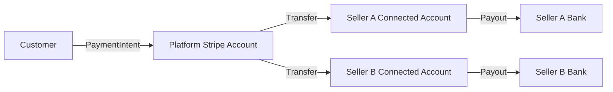

A Mercur marketplace needs **two** Stripe integrations working together. The first is the standard Medusa payment provider, which charges customers at checkout. The second is the Mercur payout provider, which transfers funds from the platform to sellers after orders are fulfilled.

This guide covers both — setting up Stripe, configuring both providers, wiring up webhooks, and understanding how money flows from customer to seller.

<Info>
  Mercur uses Stripe's [Separate Charges and Transfers](https://docs.stripe.com/connect/separate-charges-and-transfers) model. The platform collects the full payment from the customer, then creates transfers to each seller's connected account. This makes the platform the **Merchant of Record**, responsible for VAT, disputes, and chargebacks.
</Info>

## Prerequisites

- A [Stripe account](https://dashboard.stripe.com) with Connect enabled
- Stripe Secret API key and Publishable API key
- A running Mercur project ([installation guide](/v2/quickstart))
- Node.js 20+

## Architecture overview

The payment lifecycle in a Mercur marketplace flows through two distinct Stripe integrations:



The two integrations serve different purposes:

| Integration | Package | Purpose | Webhook endpoint |
|---|---|---|---|
| Customer payments | `@medusajs/medusa/payment-stripe` | Charges customers at checkout | `/hooks/payment/stripe_stripe` |
| Seller payouts | `@mercurjs/payout-stripe-connect` | Transfers funds to sellers | `/hooks/payout` |

## Stripe Dashboard setup

### 1. Enable Connect

In your Stripe Dashboard, go to **Settings → Connect settings** and enable Connect. If you're starting fresh, Stripe will walk you through an onboarding flow to activate your platform account.

### 2. Find your API keys

Go to **Developers → API keys**. You'll need:

- **Secret key** — starts with `sk_test_` (test mode) or `sk_live_` (production)
- **Publishable key** — starts with `pk_test_` or `pk_live_`

### 3. Set environment variables

Add the following to your `.env` file:

```bash
STRIPE_API_KEY=sk_test_...
STRIPE_WEBHOOK_SECRET=whsec_...
STRIPE_PAYOUT_WEBHOOK_SECRET=whsec_...
```

## Configure Medusa payment provider

The Medusa payment provider handles customer-facing charges. Add it to your `medusa-config.ts`:

```ts
module.exports = defineConfig({
  // ...
  modules: [
    {
      resolve: "@medusajs/medusa/payment",
      options: {
        providers: [
          {
            resolve: "@medusajs/medusa/payment-stripe",
            id: "stripe",
            options: {
              apiKey: process.env.STRIPE_API_KEY,
              webhookSecret: process.env.STRIPE_WEBHOOK_SECRET,
              capture: false, // Use manual capture for marketplace flow
              automatic_payment_methods: true,
            },
          },
        ],
      },
    },
  ],
})
```

### Provider options

| Option | Type | Description |
|--------|------|-------------|
| `apiKey` | `string` | Stripe secret API key |
| `webhookSecret` | `string` | Signing secret for the payment webhook endpoint |
| `capture` | `boolean` | Set to `false` for manual capture (required for marketplace split flow) |
| `automatic_payment_methods` | `boolean` | Enable Stripe's automatic payment method detection |
| `paymentDescription` | `string` | Optional description shown on customer's bank statement |

<Info>
  After configuring the provider, enable Stripe as a payment method in your Admin Panel: **Settings → Regions → Edit region → Payment providers → Stripe**.
</Info>

## Configure Mercur payout provider

The payout provider handles transfers from the platform to seller connected accounts. Add it alongside the payment provider in `medusa-config.ts`:

```ts
module.exports = defineConfig({
  // ...
  modules: [
    // ... payment provider above
    {
      resolve: "@mercurjs/core-plugin/modules/payout",
      options: {
        providers: [
          {
            resolve: "@mercurjs/payout-stripe-connect",
            id: "stripe-connect",
            options: {
              apiKey: process.env.STRIPE_API_KEY,
              webhookSecret: process.env.STRIPE_PAYOUT_WEBHOOK_SECRET,
              accountValidation: {
                detailsSubmitted: true,
                chargesEnabled: true,
                payoutsEnabled: true,
                noOutstandingRequirements: true,
                requiredCapabilities: [],
              },
            },
          },
        ],
      },
    },
  ],
})
```

### Payout provider options

| Option | Type | Default | Description |
|--------|------|---------|-------------|
| `apiKey` | `string` | — | Stripe secret API key |
| `webhookSecret` | `string` | — | Signing secret for the payout webhook endpoint |
| `accountValidation` | `object` | See below | Controls when a connected account is considered `ACTIVE` |

### Account validation options

These options determine what conditions a Stripe connected account must meet before Mercur marks it as `ACTIVE` and allows payouts:

| Option | Type | Default | Description |
|--------|------|---------|-------------|
| `detailsSubmitted` | `boolean` | `true` | Require Stripe to mark onboarding details as submitted |
| `chargesEnabled` | `boolean` | `true` | Require the account to be enabled for charges |
| `payoutsEnabled` | `boolean` | `true` | Require the account to be enabled for payouts |
| `noOutstandingRequirements` | `boolean` | `true` | Treat any pending Stripe requirements as a restricted account |
| `requiredCapabilities` | `string[]` | `[]` | Require specific Stripe capabilities to be active (e.g. `["card_payments", "transfers"]`) |

### Payout module options

The payout module itself accepts timing options that control the capture and payout pipeline:

| Option | Type | Default | Description |
|--------|------|---------|-------------|
| `disabled` | `boolean` | `false` | Disable automatic capture checks and daily payout jobs |
| `authorizationWindowMs` | `number` | `604800000` (7 days) | How long a payment authorization remains valid |
| `sellerActionWindowMs` | `number` | `259200000` (72 hours) | How long sellers have to accept/fulfill before cancellation |
| `captureSafetyBufferMs` | `number` | `86400000` (24 hours) | Safety margin before authorization expiry — capture happens before `authorization expiry - buffer` |
| `requiredFulfillmentStatus` | `string` | `"fulfilled"` | Minimum fulfillment status before an order is eligible for capture |

## Set up webhooks

You need **two separate webhook endpoints** in Stripe — one for payment events, one for payout events.

<Warning>
  These are two distinct webhook endpoints, each with its own signing secret. Do not combine them into a single endpoint.
</Warning>

### Payment webhook (Medusa)

In the Stripe Dashboard, go to **Developers → Webhooks → Add endpoint**.

- **Endpoint URL**: `https://{your-backend-url}/hooks/payment/stripe_stripe`
- **Events to subscribe to**:
  - `payment_intent.succeeded`
  - `payment_intent.amount_capturable_updated`
  - `payment_intent.payment_failed`
  - `charge.refunded`

Copy the signing secret and set it as `STRIPE_WEBHOOK_SECRET` in your `.env`.

### Payout webhook (Mercur)

Add a second webhook endpoint in the Stripe Dashboard.

- **Endpoint URL**: `https://{your-backend-url}/hooks/payout`
- **Events to subscribe to**:
  - `account.updated`

Copy the signing secret and set it as `STRIPE_PAYOUT_WEBHOOK_SECRET` in your `.env`.

## How the payment flow works

Here's a concrete example. A customer buys items from two sellers:

- **Seller A**: €40 (product)
- **Seller B**: €30 (product)
- **Shipping**: €10
- **Cart total**: €80

### Step 1 — Authorize payment

At checkout, a single `PaymentIntent` is created for €80 with `capture_method: "manual"`. The customer authenticates once (SCA-compliant). No money moves yet — the funds are held on the customer's card.

### Step 2 — Split orders

Mercur's `completeCartWithSplitOrdersWorkflow` groups items by seller and creates separate orders — one for Seller A (€40) and one for Seller B (€30), plus shipping allocation.

### Step 3 — Seller acceptance and fulfillment

Each seller reviews and fulfills their order through the Vendor Portal. The payout module's `sellerActionWindowMs` (default: 72 hours) defines how long sellers have to act.

### Step 4 — Capture payment

Once orders meet the `requiredFulfillmentStatus` (default: `"fulfilled"`), the platform captures the authorized payment. The capture-check job runs automatically and respects the `captureSafetyBufferMs` to ensure capture happens before authorization expiry.

<Warning>
  Card authorizations typically expire after **7 days**. The default configuration gives sellers 72 hours to fulfill, with a 24-hour safety buffer before capture. If your business requires longer seller action windows, consider whether the 7-day authorization window is sufficient.
</Warning>

### Step 5 — Commission calculation and transfers

After capture, Mercur calculates commission for each order and creates Stripe Transfers for the net amounts:

```
Seller A net = €40 - commission
Seller B net = €30 - commission
```

Each transfer is linked to the original charge via `source_transaction` and grouped by `transfer_group` (the order ID).

### Step 6 — Bank payouts

Stripe automatically pays out connected account balances to sellers' bank accounts on the configured payout schedule. Mercur tracks payout status changes via the `account.updated` webhook.

## Seller onboarding

When a seller creates a payout account, the following lifecycle begins:

```
PENDING → (Stripe onboarding) → ACTIVE
                                   ↓
                               RESTRICTED → ACTIVE (remediation)
                                   ↓
                               REJECTED (permanent)
```

1. **Account creation** — Mercur calls `stripe.accounts.create({ type: "express" })`, creating a Stripe Express connected account. The payout account starts in `PENDING` status.

2. **Onboarding link** — The seller receives a Stripe-hosted onboarding URL via `stripe.accountLinks.create()`. They complete identity verification, bank account setup, and any required compliance steps directly on Stripe.

3. **Webhook activation** — When the seller completes onboarding, Stripe sends an `account.updated` webhook. The provider evaluates the account against the `accountValidation` options and transitions the status:
   - All validation checks pass → `ACTIVE`
   - Missing requirements or disabled reason → `RESTRICTED`
   - Disabled reason starts with `rejected.` → `REJECTED`

4. **Ongoing monitoring** — Stripe may send additional `account.updated` events if requirements change. The provider re-evaluates and updates the status accordingly.

For more details on payout accounts, balances, and transactions, see [Payout](/v2/core-concepts/payout).

## Transfers vs payouts

Stripe uses two distinct concepts for moving money, and it's important to understand the difference:

| | Transfer | Payout |
|---|---|---|
| **What it does** | Moves funds from platform balance to connected account balance | Moves funds from connected account balance to seller's bank account |
| **Speed** | Instant ledger movement | 1–3 business days (varies by country) |
| **Status lifecycle** | None — transfers are immediate | `pending` → `in_transit` → `paid` / `failed` |
| **Who triggers it** | Mercur (via `stripe.transfers.create()`) | Stripe (on the connected account's payout schedule) |
| **Mercur tracking** | Transfer created with status `PAID` immediately | Status tracked via webhooks |

When Mercur's `createPayout` method is called, the Stripe Connect provider creates a **Transfer** (platform → connected account). The actual bank payout (connected account → bank) happens automatically on Stripe's schedule.

## Refunds and reversals

Refunding a charge does **not** automatically reverse the associated transfers. These are two separate operations:

1. **Refund the PaymentIntent** — Returns funds to the customer's payment method
2. **Reverse the Transfer(s)** — Claws back funds from the connected account(s)

For a full refund of a multi-seller order, you would need to reverse each seller's transfer individually. For partial refunds, you need to calculate how much to reverse from each seller based on which items are being refunded.

<Info>
  Refund and transfer reversal orchestration is an area where custom workflow logic may be needed depending on your business rules. See Stripe's documentation on [reversing transfers](https://docs.stripe.com/connect/separate-charges-and-transfers#reverse-transfers) for the API details.
</Info>

## EU/EEA considerations

### Merchant of Record

Using Separate Charges and Transfers makes the platform the Merchant of Record. This means:

- The platform collects and remits VAT
- The platform handles consumer disputes and chargebacks
- The platform is responsible for PSD2 compliance

### Strong Customer Authentication (SCA)

SCA is enforced at **authorization time**, not capture time. Since the customer authenticates once during checkout, no additional SCA step is needed when the platform captures later. The single authorization at checkout satisfies the SCA requirement for the entire order.

### Authorization windows

Card authorizations in Europe typically last **7 days**. Design your seller acceptance workflow to complete well within this window. The payout module options give you control over the timing:

```ts
{
  resolve: "@mercurjs/core-plugin/modules/payout",
  options: {
    authorizationWindowMs: 7 * 24 * 60 * 60 * 1000,    // 7 days
    sellerActionWindowMs: 72 * 60 * 60 * 1000,          // 72 hours
    captureSafetyBufferMs: 24 * 60 * 60 * 1000,         // 24 hours
    // ...providers
  },
}
```

## Testing

### Test mode

Use Stripe test mode keys (`sk_test_`, `pk_test_`) during development. All connected accounts and payments created in test mode are isolated from production.

**Test card number**: `4242 4242 4242 4242` (any future expiry, any CVC)

### Webhook forwarding with Stripe CLI

Since webhooks need to reach your local machine during development, use the [Stripe CLI](https://docs.stripe.com/stripe-cli) to forward events. You need **two separate listeners** — one for each webhook endpoint:

```bash
# Terminal 1 — Payment webhooks
stripe listen --forward-to localhost:9000/hooks/payment/stripe_stripe

# Terminal 2 — Payout webhooks
stripe listen --forward-to localhost:9000/hooks/payout
```

<Tip>
  Each `stripe listen` process outputs its own webhook signing secret. Use these as your `STRIPE_WEBHOOK_SECRET` and `STRIPE_PAYOUT_WEBHOOK_SECRET` respectively during local development.
</Tip>

### Testing the full flow

1. Create a seller and complete Stripe's test onboarding flow
2. Add products from the seller to a cart
3. Complete checkout using the test card
4. Verify orders are split by seller in the Admin Panel
5. Fulfill the orders through the Vendor Portal
6. Confirm transfers appear in the Stripe Dashboard under the connected account
